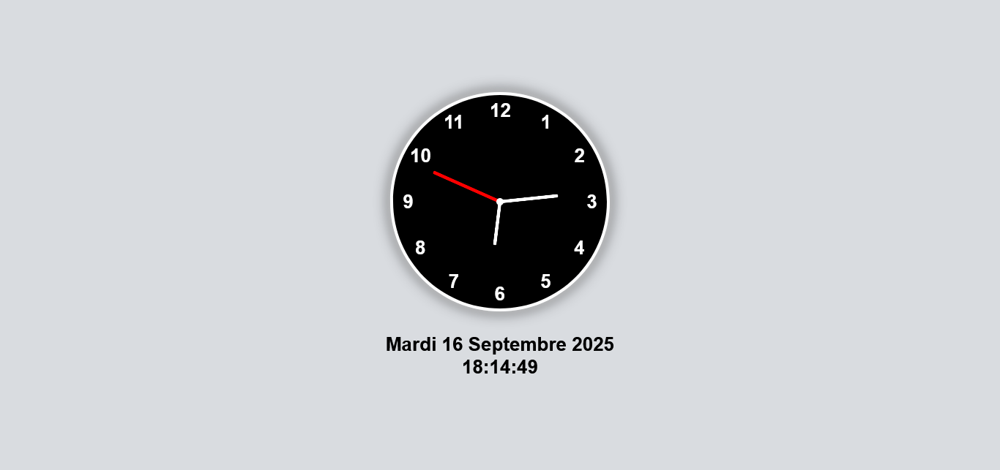

## HORLOGES ANALOGIQUE ET NUMERIQUE 🕐

## Le challenge

Création d'une horloge analogique et d'une horloge numérique en HTML, CSS et JavaScript.

## Démonstration

Lien vers le projet : https://aperbet56.github.io/horloges/

## Projet développé avec

- Utilisation des balises sémantiques HTML5
- CSS3
- Flexbox
- Animation CSS
- JavaScript
- Code JavaScript commenté
